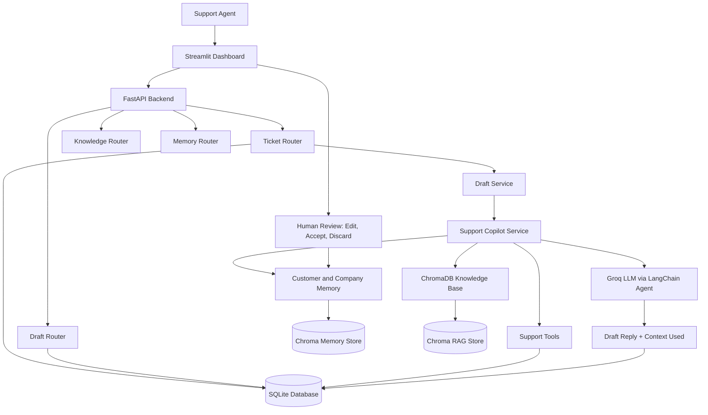
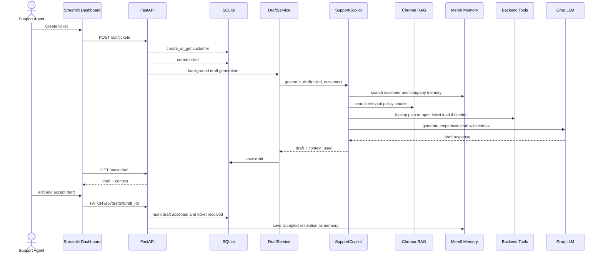
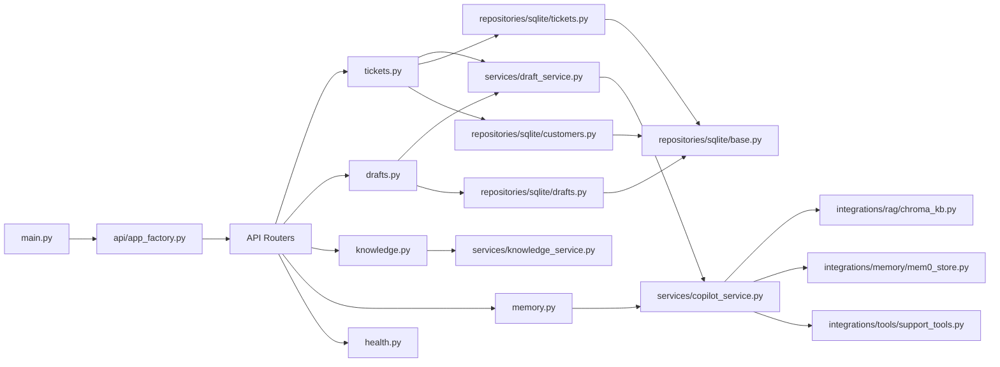
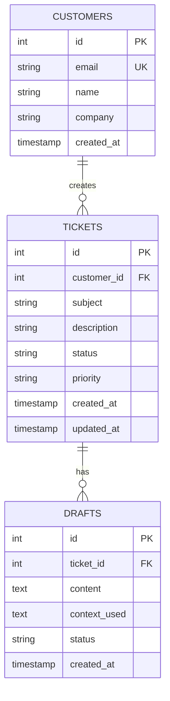
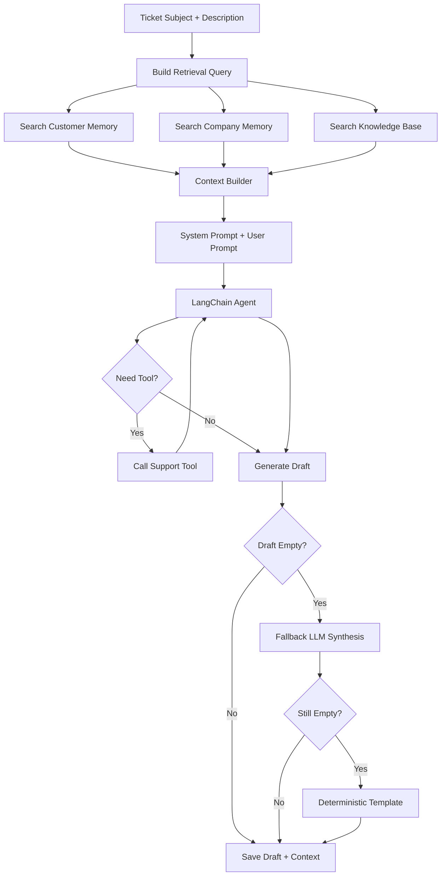
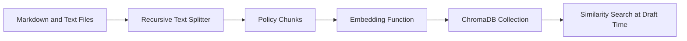
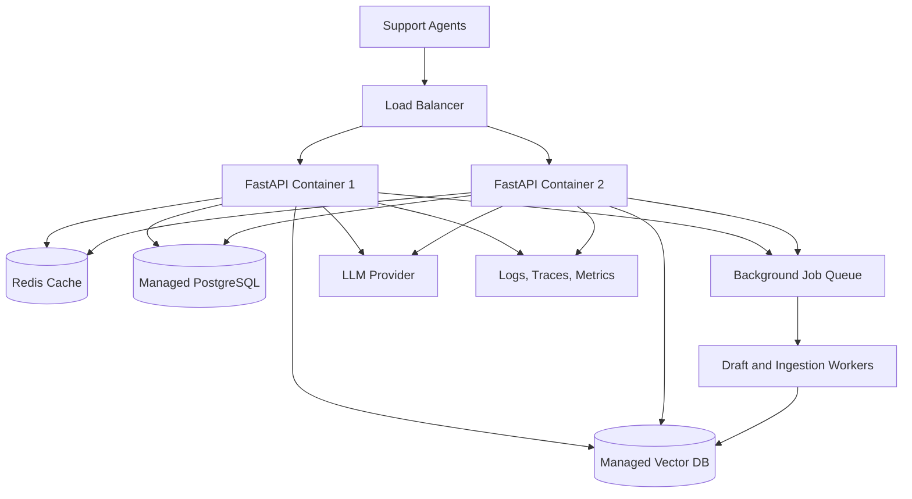

# Customer Support Agent Live

AI Copilot for Support Agents using FastAPI, Streamlit, LangChain agents, Groq LLMs, ChromaDB RAG, Mem0-style customer memory, SQLite, Docker, and EC2 deployment workflows.

This project is designed as a recruiter-friendly and interview-ready production AI application. It shows how a support team can use an AI copilot to create grounded, empathetic, and actionable customer reply drafts by combining ticket data, company knowledge, customer memory, and backend tool calls.

## Interview Pitch

Customer Support Agent Live is an AI-powered support copilot that helps human support agents respond faster and more consistently. When a ticket is created, the system stores customer and ticket details, retrieves relevant banking policy documents from a ChromaDB knowledge base, searches customer and company memory using Mem0, optionally calls backend tools to check plan and ticket load, and generates a support draft using a Groq-hosted LLM through a LangChain agent. The human support agent can review, edit, accept, or discard the draft. Accepted drafts are saved back into memory so future responses improve over time.

## Project Snapshot

| Area | Details |
|---|---|
| Domain | AI customer support automation |
| Primary user | Support agent handling customer tickets |
| Backend | FastAPI |
| Dashboard | Streamlit |
| LLM orchestration | LangChain agent with tool calling |
| LLM provider | Groq via `langchain-groq` |
| RAG store | ChromaDB persistent collection |
| Memory | Mem0 with Chroma vector store |
| Database | SQLite for customers, tickets, drafts |
| Documents | Banking policy and FAQ markdown files |
| Deployment | Docker, Docker Compose, GitHub Actions, EC2 guide |
| Main value | Faster support replies grounded in company policy, history, and tool data |

## What Problem This Solves

Support teams face three repeated production problems:

1. Agents spend too much time rewriting similar responses.
2. Answers become inconsistent when company policies are scattered across documents.
3. Support quality drops when agents do not know the customer's previous issues, plan, SLA, or ticket load.

This project solves those problems by building a support copilot that:

- Retrieves relevant policy from the knowledge base.
- Searches previous customer and company memories.
- Calls backend tools for structured support context.
- Generates a draft that a human agent can review before sending.
- Saves accepted resolutions as memory for future tickets.

## Core Features

- Create and list support tickets.
- Auto-generate support draft replies in the background.
- Manually regenerate drafts for a ticket.
- Accept or discard AI-generated drafts.
- Save accepted resolutions into long-term memory.
- Search customer memory from the dashboard.
- Ingest banking policy documents into ChromaDB.
- Display the exact context used for each draft.
- Expose FastAPI endpoints and a Streamlit support dashboard.
- Run locally with Docker Compose.
- Deploy simply to EC2 with GitHub Actions.

## High-Level Architecture



## Complete Request Flow



## Code Flow



## Data Model



## AI Draft Generation Pipeline



## Knowledge Base

The project stores banking support documents in `knowledge_base/`:

- `saving-account-rule.md`
- `banking-kyc-and-account-update-rules.md`
- `banking-charges-and-minimum-balance.md`
- `banking-atm-cash-withdrawal-faq.md`

The ingestion pipeline:



## Memory Design

The system uses two memory scopes:

| Scope | Purpose |
|---|---|
| Customer memory | User-specific history, previous issues, preferences, accepted resolutions |
| Company memory | Shared account or organization-level issues affecting multiple users from the same company |

Why both scopes matter:

- A customer may have repeated account-specific issues.
- A company may have recurring integration, billing, SLA, or operational problems.
- Future support drafts become more personalized and less repetitive.
- Accepted resolutions become reusable support knowledge.

## Tool Calling

The support copilot has backend tools:

| Tool | Purpose |
|---|---|
| `lookup_customer_plan(customer_email)` | Returns plan tier, SLA hours, and priority queue status |
| `lookup_open_ticket_load(customer_email)` | Returns number of open tickets and customer load band |

Tool calling improves answer quality because the LLM does not guess structured data. It can use backend facts to create a more accurate support response.

## API Endpoints

| Method | Endpoint | Purpose |
|---|---|---|
| `GET` | `/health` | Health check |
| `POST` | `/api/tickets` | Create ticket and optionally auto-generate draft |
| `GET` | `/api/tickets` | List tickets |
| `GET` | `/api/tickets/{ticket_id}` | Get one ticket |
| `POST` | `/api/tickets/{ticket_id}/generate-draft` | Manually generate draft |
| `GET` | `/api/drafts/{ticket_id}` | Get latest draft for ticket |
| `PATCH` | `/api/drafts/{draft_id}` | Update draft content or status |
| `POST` | `/api/knowledge/ingest` | Ingest knowledge base into ChromaDB |
| `GET` | `/api/customers/{customer_id}/memories` | List customer memories |
| `GET` | `/api/customers/{customer_id}/memory-search` | Search customer and company memory |

## Local Setup

### Prerequisites

- Python 3.11
- uv
- Docker and Docker Compose
- Groq API key
- One embedding provider for memory:
  - Google API key, or
  - OpenAI API key, or
  - local embeddings enabled

### Environment Variables

Create `.env` in the project root:

```bash
GROQ_API_KEY=your_groq_key
GROQ_MODEL=llama-3.1-8b-instant
LLM_TEMPERATURE=0.2

# Recommended for Mem0 embeddings
GOOGLE_API_KEY=your_google_key
GOOGLE_EMBEDDING_MODEL=gemini-embedding-001

# Optional alternative
OPENAI_API_KEY=your_openai_key

API_HOST=0.0.0.0
API_PORT=8000
```

### Run Locally With uv

```bash
uv sync
uv run python main.py
```

In another terminal:

```bash
uv run streamlit run app.py
```

Open:

- FastAPI: `http://localhost:8000`
- Swagger docs: `http://localhost:8000/docs`
- Streamlit dashboard: `http://localhost:8501`

### Run With Docker Compose

```bash
docker compose up -d --build
```

Open:

- API health: `http://localhost:8000/health`
- Dashboard: `http://localhost:8501`

## Typical Demo Flow

1. Start API and dashboard.
2. Click `Ingest Knowledge Base` in the dashboard.
3. Create a ticket with customer email, company, subject, description, and priority.
4. Let the system auto-generate the draft or click `Generate Draft`.
5. Expand `Context used` to show memory hits, KB hits, tool calls, and errors.
6. Edit the generated draft if needed.
7. Accept the draft.
8. Verify that the ticket becomes resolved and accepted resolution is saved into memory.
9. Use `Memory Probe` to search previous customer/company context.

## Production-Level Support Chatbot Checklist

This project demonstrates the core workflow. A production support chatbot or copilot should add the following engineering layers:

| Production Area | Needed Capability |
|---|---|
| Authentication | JWT or OAuth login for support agents |
| Authorization | RBAC for admin, agent, reviewer, and auditor roles |
| Multi-tenancy | Tenant isolation for customers, companies, and knowledge bases |
| Data security | PII masking, encryption at rest, encryption in transit |
| Prompt security | Prompt injection detection, tool permission checks, system prompt hardening |
| Human control | Approval before sending messages or taking sensitive actions |
| Observability | Logs, traces, metrics, LLM call tracking, retrieval traces |
| Evaluation | RAG quality, draft quality, tool-call accuracy, human acceptance rate |
| Caching | Redis cache for repeated retrieval, model responses, and session data |
| Queueing | Celery, RQ, or cloud queues for background generation and ingestion |
| Scalability | Stateless API replicas, load balancer, managed DB, managed vector DB |
| Reliability | Retries, circuit breakers, fallbacks, timeouts, dead-letter queues |
| Compliance | Audit logs, retention policy, data deletion, access reviews |

## Production Deployment Direction

Current deployment support:

- Dockerfile for containerized API and dashboard.
- Docker Compose for local or EC2 deployment.
- GitHub Actions CI workflow.
- GitHub Actions EC2 deployment workflow.
- EC2 deployment documentation in `docs/EC2_deployment_flow.md`.

Recommended production upgrade:



## Interview Talking Points

Use this when explaining the project:

> This project is an AI support copilot, not just a chatbot. It uses FastAPI for backend APIs, Streamlit for the support dashboard, ChromaDB for RAG over banking policy documents, Mem0-style memory for previous customer and company resolutions, and LangChain tool calling for structured support data like plan tier and open ticket load. The LLM generates a draft, but the human agent remains in control by reviewing, editing, accepting, or discarding it. When a draft is accepted, the resolution is written back into memory so future answers improve.

Strong keywords:

- AI support copilot
- RAG grounded response
- Customer memory
- Company-level memory
- Tool calling
- Human-in-the-loop review
- Context traceability
- Draft fallback strategy
- Production readiness
- Support automation

## What I Would Improve Next

- Add JWT/OAuth authentication for support agents.
- Add RBAC for admin, agent, and reviewer roles.
- Replace SQLite with PostgreSQL for production.
- Add Redis caching for repeated memory, RAG, and draft requests.
- Add async job queue for background draft generation.
- Add prompt injection scanning and PII redaction.
- Add retrieval and draft quality evaluation.
- Add Langfuse, OpenTelemetry, or similar tracing.
- Add unit tests for repositories, services, routers, RAG ingestion, and tool calls.
- Add streaming draft generation in the dashboard.

## Repository Structure

```text
.
|-- app.py                                  # Streamlit dashboard
|-- main.py                                 # FastAPI entrypoint
|-- Dockerfile
|-- docker-compose.yml
|-- knowledge_base/                         # Banking policy docs
|-- docs/                                   # Deployment documentation
|-- tests/                                  # Tests
|-- customer_support_agent/
|   |-- api/
|   |   |-- app_factory.py                  # FastAPI app factory
|   |   |-- dependencies.py                 # Dependency injection
|   |   `-- routers/                        # API routes
|   |-- core/
|   |   `-- settings.py                     # Environment config
|   |-- integrations/
|   |   |-- rag/chroma_kb.py                # ChromaDB RAG
|   |   |-- memory/mem0_store.py            # Mem0 memory wrapper
|   |   `-- tools/support_tools.py          # Agent tools
|   |-- repositories/sqlite/                # SQLite repositories
|   |-- schemas/api.py                      # Pydantic models
|   `-- services/
|       |-- copilot_service.py              # Main AI copilot logic
|       |-- draft_service.py                # Draft persistence flow
|       `-- knowledge_service.py            # KB ingestion service
```

## License

Portfolio project for AI engineering, GenAI, backend, and production RAG interview preparation.
